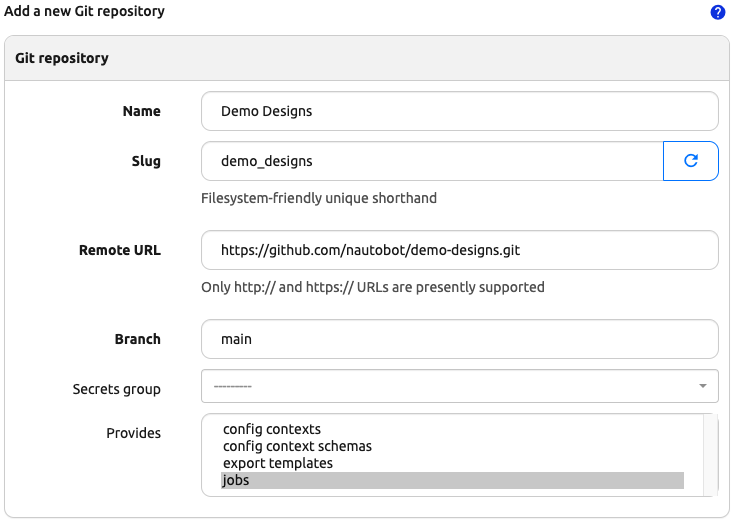
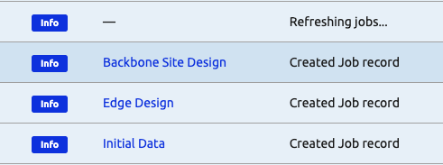

# Design Builder Demo Designs

This repository contains a selection of demo designs. This repo includes a complete docker-compose based application stack so that the repo can be cloned and run in a local development environment. Additionally, the repo can be imported directly into an existing Nautobot instance that has the design builder application installed and enabled.

## Local Environment

Python poetry can be used to set up a local environment. Docker and Docker Compose must also be present on the local system. To get started, clone the repository and build and start the docker environment.

```shell
git clone git@github.com:nautobot/demo-designs.git
poetry shell
poetry install
invoke build
invoke start
```

Once the application stack has fully started, navigate to <https://localhost:8080> in your browser. The designs should show up on the jobs page within Nautobot and should be grouped under the "Demo Designs" grouping.

To see the debug output from the Nautobot application stack, open a new terminal and run `invoke debug`

## Loading as a Git Datasource

This repository can also be loaded into Nautobot as a git datasource. The Nautobot instance must already have the design builder application installed and configured. Add this repository as a git data source, make sure to select `jobs` in the `Provides` selection:



Once the git data source has been created and synchronized, you should see output similar to the following, in the sync job result:



At that time, the design jobs should be loaded and visible in the `Jobs` view under the `Demo Designs` grouping:


